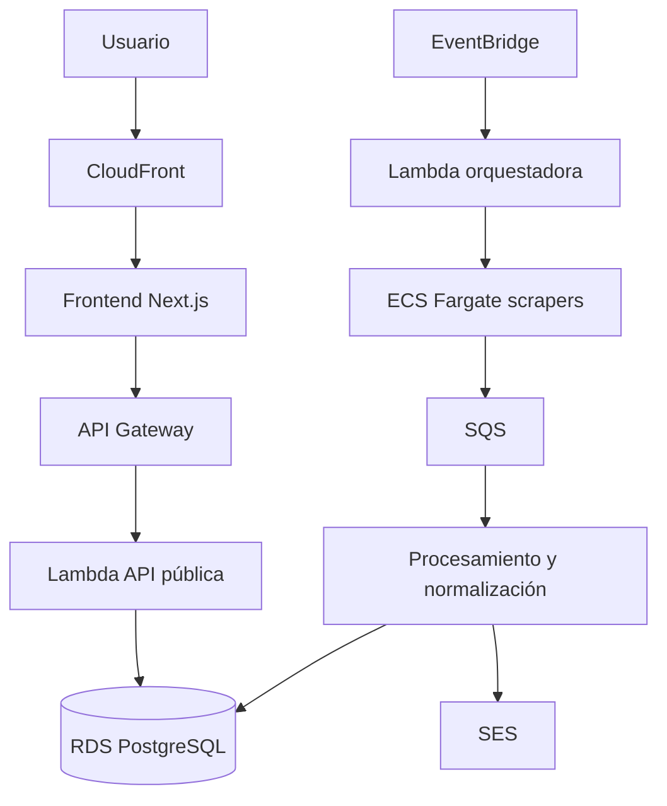

# Arquitectura inicial

## Visión general

El diagrama representa la dirección esperada, no una especificación cerrada de despliegue. Durante el MVP algunos consumidores o procesos pueden implementarse en una misma Lambda si eso reduce complejidad sin comprometer el dominio.

## Componentes

### Frontend

- Next.js, React y Tailwind CSS.
- Interfaz mobile-first.
- Distribución mediante S3 y CloudFront.
- Consume únicamente la API pública.

Debe confirmarse si se utilizará exportación estática completa, renderizado híbrido o una variante compatible con el hosting elegido.

### API pública

- API Gateway como entrada HTTP.
- AWS Lambda para búsquedas, detalle de eventos y otras operaciones del cliente.
- Contratos versionados y respuestas estables.

### Ingesta y scraping

- EventBridge inicia procesos programados.
- Una Lambda privada decide qué fuentes procesar y crea trabajos.
- Los scrapers que requieren navegador se ejecutan como ECS Fargate Tasks.
- Playwright y Puppeteer permanecen como alternativas hasta realizar una prueba con las primeras fuentes.
- Los resultados se publican en SQS para desacoplar extracción y procesamiento.

### Procesamiento

Responsabilidades esperadas:

1. Validar el resultado de la extracción.
2. Conservar el payload o referencia original cuando sea pertinente.
3. Normalizar artistas, recintos, fechas, precios y URLs.
4. Detectar coincidencias y duplicados.
5. Persistir de forma idempotente.
6. Registrar trazabilidad y errores recuperables.

### Persistencia

- PostgreSQL en Amazon RDS.
- Modelo relacional para eventos, funciones, artistas, recintos, fuentes y publicaciones externas.
- Migraciones versionadas dentro del repositorio.

### Observabilidad

- Logs JSON estructurados.
- Propagación de W3C Trace Context.
- Métricas mínimas: ejecuciones por fuente, eventos encontrados, errores, duración, reintentos y antigüedad del último resultado exitoso.
- Alarmas para fallas reiteradas y fuentes que dejan de entregar resultados.

## Flujo inicial de ingesta

1. EventBridge activa la orquestación.
2. La orquestadora identifica las fuentes que deben actualizarse.
3. Se ejecuta un scraper por fuente o partición.
4. El scraper extrae y publica resultados en SQS.
5. El consumidor valida, normaliza y deduplica.
6. PostgreSQL almacena el evento canónico y su publicación externa.
7. La API pública expone los datos al frontend.

## Principios

- Idempotencia: repetir un trabajo no debe crear copias innecesarias.
- Trazabilidad: cada dato publicado debe poder relacionarse con su fuente.
- Aislamiento: una fuente defectuosa no debe detener el resto.
- Evolución incremental: implementar primero un flujo vertical completo.
- Seguridad: mínimos privilegios, secretos fuera del código y servicios privados cuando corresponda.

