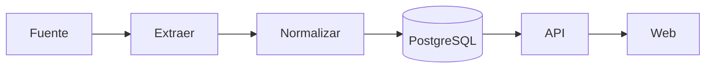
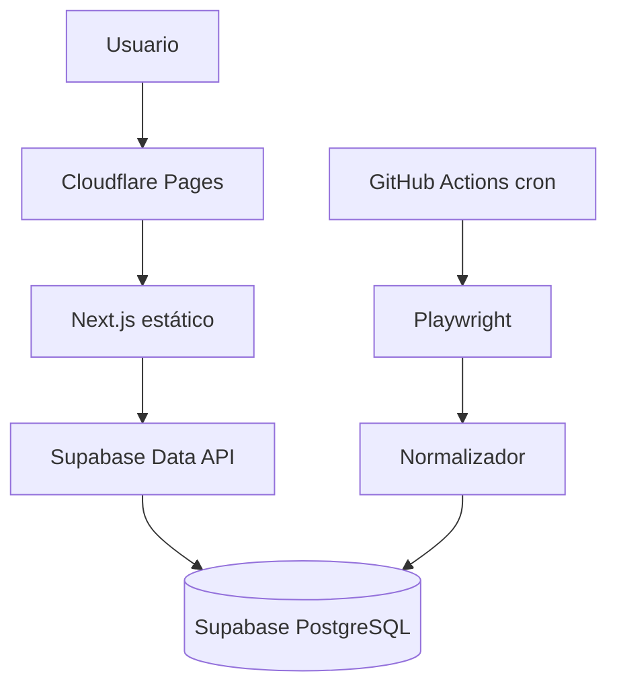
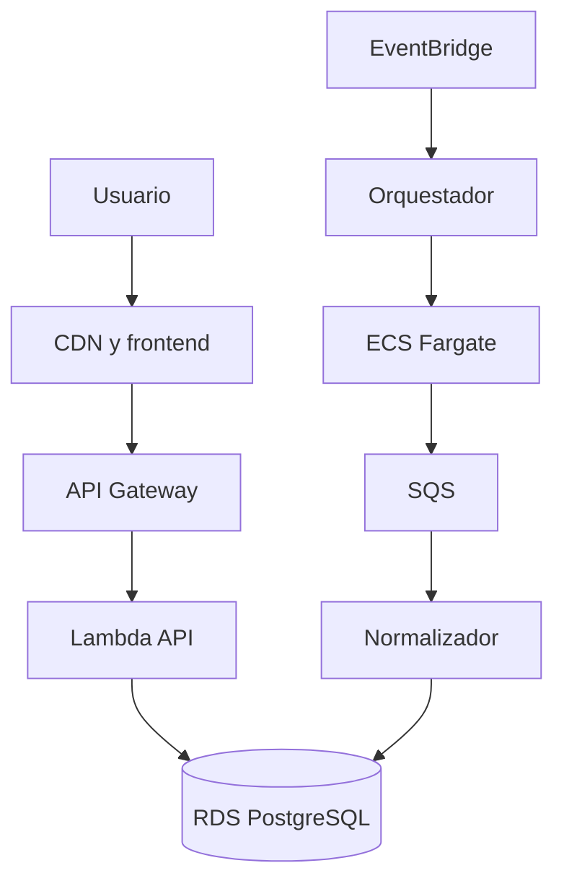

# Brief de ejecución y crecimiento — miShow

**Estado:** borrador para iniciar ejecución  
**Fecha de revisión:** 8 de septiembre de 2026  
**Objetivo:** construir una primera versión útil con costo de infraestructura de **$0 mensual**, manteniendo una ruta explícita de crecimiento.

> Los límites y precios mencionados corresponden a la documentación consultada en la fecha de revisión. Deben verificarse nuevamente antes de cada decisión de despliegue o cambio de etapa.

## 1. Resumen ejecutivo

miShow comenzará como un catálogo público de conciertos y eventos musicales en Chile. La primera versión validará tres riesgos antes de invertir en infraestructura:

1. Que sea técnicamente posible obtener información estable desde las fuentes elegidas.
2. Que la normalización y deduplicación produzcan un catálogo confiable.
3. Que el producto resulte útil y genere uso recurrente.

La arquitectura inicial no intentará implementar desde el primer día toda la arquitectura objetivo en AWS. Se utilizarán servicios con capa gratuita permanente o incluida, con límites de gasto bloqueados, y se mantendrán separadas las capas de extracción, dominio, persistencia y presentación.

### Propuesta inicial

| Necesidad | Inicio a $0 | Evolución prevista |
|---|---|---|
| Repositorio y CI | GitHub | GitHub con mayor cuota o runners dedicados |
| Frontend | Next.js con exportación estática en Cloudflare Pages | Cloudflare o hosting SSR según necesidades reales |
| API pública | Supabase Data API o Cloudflare Worker delgado | Lambda + API Gateway u otro runtime administrado |
| Base de datos | Supabase PostgreSQL Free | Supabase Pro o RDS PostgreSQL |
| Scraping programado | GitHub Actions + Playwright | ECS Fargate Tasks |
| Programación | Cron de GitHub Actions | EventBridge Scheduler |
| Cola | Sin cola en el primer flujo | SQS al aumentar fuentes y concurrencia |
| Archivos e imágenes | URLs de las fuentes; sin duplicar imágenes inicialmente | S3 + CloudFront cuando sea necesario |
| Correo | No incluido inicialmente | SES cuando existan alertas o cuentas |
| Observabilidad | Logs de Actions y tablas de ejecución | CloudWatch, métricas y trazabilidad distribuida |

## 2. Principios de diseño

### Costo cero controlado

- No habilitar cobro por exceso automáticamente.
- Configurar presupuestos, alertas y límites donde el proveedor lo permita.
- Ante un límite gratuito, preferir degradación controlada o pausa antes que facturación inesperada.
- El dominio y otros costos ya contratados no se consideran infraestructura mensual de la aplicación.

### Portabilidad selectiva

No se busca evitar todo acoplamiento a proveedores. Se busca proteger las partes costosas de reescribir:

- Modelo del dominio.
- Contratos de extracción y normalización.
- Migraciones SQL compatibles con PostgreSQL.
- Casos de uso y reglas de negocio.
- Componentes visuales y rutas públicas.

Los adaptadores de hosting, ejecución programada y almacenamiento pueden cambiar por etapa.

### Escalar por evidencia

Cada componente nuevo debe responder a un límite observado. No se incorporarán colas, microservicios, cachés distribuidos o motores de búsqueda antes de necesitarlos.

### Flujo vertical primero

La primera meta técnica no es “tener la plataforma”, sino completar una fuente de extremo a extremo:



## 3. Arquitectura inicial gratuita



### Frontend

- Next.js, React y Tailwind CSS.
- Exportación estática para evitar un servidor permanente.
- Despliegue automático desde GitHub hacia Cloudflare Pages.
- Páginas iniciales: inicio/listado, búsqueda, filtros y detalle.
- SEO básico mediante metadatos generados y rutas estables.

Cloudflare Pages permite 500 builds mensuales en el plan gratuito y documenta soporte para exportaciones estáticas de Next.js. Esto es suficiente para el ritmo inicial de desarrollo, pero no debe usarse cada cambio de datos como un nuevo despliegue. [Límites oficiales de Cloudflare Pages](https://developers.cloudflare.com/pages/platform/limits/)

### Base de datos y API

- Supabase Free como PostgreSQL administrado.
- Migraciones SQL versionadas en el repositorio.
- Acceso público exclusivamente de lectura mediante políticas Row Level Security.
- Escrituras de scraping solamente con credenciales de servidor guardadas como secretos de GitHub.
- Ninguna clave privilegiada debe llegar al navegador.
- No se implementará autenticación de usuarios mientras el MVP no la necesite.

Supabase ofrece un plan Free y un camino directo a Pro; antes de producción pública se deben reconfirmar almacenamiento, egreso, pausas por inactividad y respaldos incluidos. [Planes oficiales de Supabase](https://supabase.com/pricing) y [documentación oficial de facturación](https://supabase.com/docs/guides/platform/billing-on-supabase).

Se prefiere Supabase sobre Cloudflare D1 en esta etapa porque conserva PostgreSQL y reduce el costo futuro de migrar a RDS. D1 también tiene una capa gratuita —actualmente hasta 500 MB por base y 5 GB totales por cuenta—, pero usa una base compatible con SQLite y cambiaría la ruta de migración acordada. [Límites oficiales de Cloudflare D1](https://developers.cloudflare.com/d1/platform/limits/)

### Scraping

- Un workflow programado de GitHub Actions ejecutará Playwright.
- Inicialmente habrá una sola ejecución que procese una única fuente.
- La frecuencia comenzará baja, por ejemplo dos veces al día.
- Cada ejecución tendrá timeout, reintentos acotados y registro de resultados.
- Los registros se escribirán mediante `upsert` y claves idempotentes.
- Los HTML completos y capturas solo se conservarán cuando exista un error que diagnosticar, con retención breve.

GitHub Free incluye actualmente 2.000 minutos mensuales de Actions para repositorios privados y 500 MB de artefactos; los runners estándar de repositorios públicos no consumen minutos pagados. Para mantener costo cero en un repositorio privado, el workflow debe diseñarse y monitorearse bajo esa cuota. [Facturación oficial de GitHub Actions](https://docs.github.com/en/billing/concepts/product-billing/github-actions)

### API intermedia

En la primera versión, el frontend puede consultar vistas públicas de Supabase. Se agregará un Cloudflare Worker solo si se necesita:

- Ocultar estructura interna de consultas.
- Componer varias consultas.
- Aplicar caché o rate limiting.
- Mantener un contrato independiente del proveedor.

El plan gratuito de Workers admite actualmente 100.000 solicitudes por día. Si se supera el límite, las solicitudes fallan en lugar de continuar ilimitadamente, comportamiento compatible con la política de costo controlado. [Límites oficiales de Cloudflare Workers](https://developers.cloudflare.com/workers/platform/limits/)

## 4. Etapas del proyecto

## Etapa 0 — Fundaciones y prueba técnica

**Objetivo:** comprobar que una fuente puede extraerse, normalizarse y persistirse de forma reproducible.

### Entregables

- Monorepo TypeScript inicial.
- Convenciones, lint, pruebas y validación de tipos.
- Contratos `RawEvent`, `NormalizedEvent` y resultados de ingesta.
- Primera migración PostgreSQL.
- Scraper de una fuente ejecutable localmente.
- Fixtures HTML para probar sin golpear continuamente la fuente.
- Registro de ejecución con conteos y errores.
- Documento sobre condiciones de uso, robots y límites de la fuente.

### Criterio de salida

- El mismo input produce el mismo resultado normalizado.
- Reprocesar los datos no crea duplicados.
- Los cambios de HTML se detectan mediante pruebas con fixtures.
- No se requieren credenciales productivas para ejecutar pruebas.

### Infraestructura

Local y GitHub. No es necesario desplegar todavía.

## Etapa 1 — MVP público a costo cero

**Objetivo:** publicar un catálogo útil basado en una fuente y validar uso real.

### Entregables

- Cloudflare Pages conectado al repositorio.
- Supabase Free con migraciones y políticas de acceso.
- Workflow programado de GitHub Actions.
- Listado, búsqueda básica, filtros y detalle de evento.
- Enlace visible a la ticketera original.
- Página de estado o indicador interno de última actualización.
- Analítica respetuosa de privacidad, si se considera necesaria.

### Criterio de salida

- Catálogo actualizado automáticamente durante al menos cuatro semanas.
- Errores de scraping detectables sin revisión manual diaria.
- Uso real medible y señales de retorno de usuarios.
- Consumo estable dentro de las cuotas gratuitas.

### Restricción

No incorporar login, favoritos ni notificaciones hasta confirmar que mejoran una necesidad real.

## Etapa 2 — Cobertura y confiabilidad

**Objetivo:** agregar fuentes sin que cada integración incremente el riesgo de todo el sistema.

### Entregables

- Dos a cinco fuentes prioritarias.
- Adaptador común de fuentes.
- Deduplicación entre ticketeras.
- Panel operativo mínimo para ejecuciones y errores.
- Reintentos selectivos por fuente.
- Contrato de API propio mediante Worker si el acoplamiento directo a Supabase comienza a dificultar cambios.
- Caché para lecturas frecuentes.

### Criterios para permanecer en la capa gratuita

- Actions se mantiene con margen bajo su cuota mensual.
- Base de datos y egreso se mantienen bajo 70–80 % de los límites.
- La frecuencia de scraping sigue cumpliendo la frescura esperada.
- Las ejecuciones no compiten ni acumulan retrasos.

### Disparadores de migración

- Playwright consume demasiados minutos o presenta ejecuciones inestables.
- Se necesitan ejecuciones concurrentes o colas.
- Una fuente requiere IP, memoria, CPU o duración no apropiadas para Actions.
- La base se acerca a su límite, se necesitan respaldos formales o el proyecto no puede tolerar pausas.
- El frontend necesita renderizado dinámico complejo o personalización por usuario.

## Etapa 3 — Primera infraestructura pagada

**Objetivo:** pagar solo por los cuellos de botella que ya tengan evidencia.

La primera migración no tiene que ser completa. Orden recomendado:

1. Mover scrapers a ECS Fargate Tasks.
2. Usar EventBridge Scheduler para programarlos.
3. Incorporar SQS entre extracción y normalización.
4. Mantener Supabase temporalmente si la base aún no es el cuello de botella.
5. Migrar PostgreSQL a RDS cuando disponibilidad, respaldo, volumen o gobierno lo justifiquen.
6. Incorporar Lambda + API Gateway si el Worker o la API directa dejan de ser suficientes.

### Arquitectura esperada



### Criterio de salida

- Operación observable y recuperable.
- Backups y restauración probados.
- Costos atribuibles por componente y fuente.
- Capacidad de agregar fuentes sin degradar las existentes.

## Etapa 4 — Producto con cuentas y monetización

**Objetivo:** introducir funcionalidades personales solamente después de validar el catálogo público.

Posibles capacidades:

- Favoritos.
- Alertas por artista, recinto o ciudad.
- Agenda personal.
- Notificaciones por correo.
- Panel para promotores u organizadores.
- Destacados o afiliación, claramente identificados.

Esta etapa requiere revisar autenticación, privacidad, consentimiento, retención y seguridad. SES y un proveedor de identidad se incorporarán solo entonces.

## 5. Estrategia de escalabilidad

### Escalabilidad funcional

- Una fuente se implementa como un adaptador independiente.
- El scraper entrega datos crudos; no decide el modelo final.
- El normalizador contiene las reglas compartidas.
- La deduplicación puede evolucionar sin reescribir cada scraper.

### Escalabilidad de datos

- Claves externas únicas por fuente.
- `upsert` idempotente.
- Índices desde consultas reales, no anticipados indiscriminadamente.
- Payload original separado del modelo canónico.
- Política explícita de retención de HTML, imágenes y registros.

### Escalabilidad operativa

- Registrar por ejecución: fuente, inicio, término, duración, estado, encontrados, creados, actualizados y errores.
- Evitar que un fallo global dependa de una única fuente.
- Definir timeout y presupuesto de reintentos.
- Incorporar cola cuando exista concurrencia o backlog real.

### Escalabilidad de costos

- Medir costo por fuente y por mil eventos procesados cuando comience el gasto.
- Cachear resultados públicos con alta repetición.
- No almacenar copias de imágenes hasta que sea necesario.
- Ejecutar scraping según frecuencia de cambio observada, no con una frecuencia uniforme.

## 6. Diseño del repositorio

Estructura propuesta para iniciar:

```text
mishow/
├── AGENTS.md
├── README.md
├── apps/
│   └── web/
├── packages/
│   ├── domain/
│   ├── database/
│   └── source-contracts/
├── scrapers/
│   └── first-source/
├── supabase/
│   └── migrations/
├── .github/
│   └── workflows/
├── docs/
└── fixtures/
```

### Motivo del monorepo inicial

- Un solo cambio puede actualizar scraper, contrato, migración y frontend.
- Evita publicar paquetes internos prematuramente.
- Simplifica CI/CD para una sola persona.
- Más adelante cada runtime puede desplegarse de manera independiente desde la misma base.

## 7. Seguridad y control de gasto

- Repositorio privado durante la exploración si los scrapers o decisiones de negocio no deben ser públicos.
- Proteger la rama principal y trabajar mediante pull requests cuando comience a haber tráfico.
- Guardar claves de Supabase únicamente en secretos de GitHub y variables seguras del proveedor.
- Exponer en el navegador solamente una clave pública con políticas RLS estrictas.
- Nunca ejecutar scraping autenticado con credenciales personales sin una decisión explícita.
- Mantener deshabilitado o en cero el gasto adicional automático cuando sea posible.
- Configurar alertas al 50 %, 70 % y 90 % de cada cuota medible.
- Mantener backups exportables antes de depender operativamente del catálogo.

## 8. Riesgos principales

| Riesgo | Impacto | Mitigación inicial |
|---|---|---|
| Cambios de HTML | Datos incompletos o scraper roto | Fixtures, validación de selectores y alerta por caída anormal de resultados |
| Restricciones de la fuente | Bloqueos o conflicto de uso | Revisar términos, limitar frecuencia y priorizar APIs o feeds cuando existan |
| Duplicados | Catálogo poco confiable | Identificadores externos, normalización y revisión de coincidencias inciertas |
| Cuota de Actions | Actualizaciones detenidas | Baja frecuencia, timeout, caché de dependencias y migración selectiva a Fargate |
| Límite gratuito de base | Servicio pausado o sin capacidad | Alertas, exportaciones y umbral de migración antes del 80 % |
| Dependencia directa de Supabase | Migración más difícil | Repositorio de acceso a datos, migraciones PostgreSQL y API propia cuando se justifique |
| Sobrearquitectura | Demora sin validar valor | Flujo vertical y criterios de salida por etapa |

## 9. Métricas para decidir crecimiento

### Producto

- Usuarios y sesiones semanales.
- Porcentaje de usuarios que vuelve.
- Búsquedas realizadas.
- Aperturas de detalles.
- Clics hacia ticketera.

### Calidad del catálogo

- Eventos activos por fuente.
- Porcentaje con fecha, recinto, imagen y precio.
- Duplicados confirmados o candidatos.
- Antigüedad del último dato exitoso.

### Operación

- Duración y éxito de ingestas.
- Minutos de Actions consumidos.
- Errores por fuente.
- Tamaño y egreso de base de datos.
- Solicitudes del frontend/API.

## 10. Decisiones que debemos cerrar antes de ejecutar

1. Primera ticketera o fuente a integrar.
2. Repositorio público o privado.
3. Frecuencia mínima aceptable de actualización.
4. Qué campos son obligatorios para publicar un evento.
5. Si el MVP cubre solo Santiago o todo Chile.
6. Política frente a eventos duplicados o coincidencias inciertas.
7. Nivel de uso permitido de logos e imágenes provenientes de las fuentes.
8. Métrica principal de validación: búsquedas, retorno o clics hacia ticketeras.

## 11. Primer ciclo de ejecución propuesto

### Hito 1 — Fundaciones

- Crear el monorepo.
- Configurar TypeScript, lint, tests y CI.
- Definir contratos del dominio.
- Crear esquema PostgreSQL inicial.

### Hito 2 — Primera fuente

- Investigar técnicamente y legalmente la fuente elegida.
- Guardar fixtures representativos.
- Implementar extracción y normalización.
- Persistir mediante `upsert`.

### Hito 3 — Catálogo web

- Construir listado, filtros y detalle.
- Conectar lecturas seguras.
- Agregar estados de carga, vacío y error.
- Validar diseño móvil y accesibilidad.

### Hito 4 — Automatización gratuita

- Desplegar frontend en Cloudflare Pages.
- Crear proyecto Supabase Free.
- Programar el workflow de scraping.
- Configurar métricas, alertas de cuota y documentación operativa.

### Hito 5 — Validación

- Operar durante cuatro semanas.
- Corregir calidad y estabilidad.
- Revisar métricas y decidir si agregar otra fuente o ajustar la propuesta.

## 12. Instrucción inicial para Codex

```text
Lee AGENTS.md y toda la documentación dentro de docs/.
Usa docs/brief-ejecucion.md como guía principal para las etapas y
docs/modelo-datos.md como borrador, no como esquema definitivo.

Comienza por la Etapa 0. Antes de escribir código:
1. Propón la estructura exacta del monorepo.
2. Enumera las decisiones técnicas mínimas que debemos cerrar.
3. Define el contrato del primer scraper sin asumir todavía una ticketera.
4. Divide el Hito 1 en cambios pequeños y verificables.

No despliegues servicios, no crees recursos pagados y no agregues
dependencias hasta que la propuesta sea aprobada.
```

