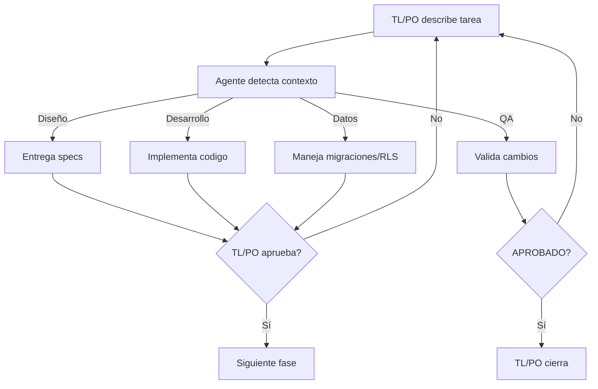

# Equipo de agentes y flujo de trabajo

## Modelo de equipo — Agente único

Un agente único (`mishow`) detecta contexto de la tarea y actúa según rol necesario.

| Rol | Responsable | Autoridad principal |
|---|---|---|
| PO | Rodrigo + asistente principal | Problema, prioridad, alcance y criterios de aceptación |
| TL | Rodrigo + asistente principal | Arquitectura, división técnica, riesgos y aprobación del enfoque |
| Agente | `mishow` (contexto-detectado) | Diseña specs, implementa código, valida, maneja BD según lo solicitado |

TL/PO conserva la decisión final. El agente detecta automáticamente si necesita diseñar (devuelve specs), implementar (edita código), validar (verifica) o tocar BD (migraciones/RLS). No decide unilateralmente nuevas funcionalidades, gastos o despliegues.

## Por qué un agente único

- **Simplicidad:** TL/PO describe la tarea naturalmente. El agente detecta contexto (palabras clave: "diseña", "implementa", "valida", "migra").
- **Eficiencia:** -60% tokens respecto a 4 agentes separados. Contexto base agente único ~400w.
- **Continuidad:** Una sola "personalidad" durante toda la historia. Menos cambio de contexto.
- **Skills reutilizables:** `$mishow-implement-feature`, `$mishow-qa-review` siguen disponibles, agente las invoca según contexto.

## Flujo de una historia



Agente pausa entre fases para aprobación TL/PO cuando sea necesario. Diseño es opcional para tareas puramente técnicas. QA no es opcional para cambios de comportamiento.

## Contrato de historia lista para trabajar

Una historia está `READY` cuando contiene:

- Problema y usuario afectado.
- Resultado esperado.
- Alcance incluido y excluido.
- Criterios de aceptación observables.
- Diseño o decisión de que no lo requiere.
- Restricciones técnicas o de costo.
- Métrica o forma de validar valor cuando corresponda.

## Handoffs (agente → TL/PO)

**Diseño:**
- Objetivo, flujo, especificación por pantalla.
- Componentes, estados, contenido.
- Criterios de aceptación visual.
- Preguntas abiertas si hay incertidumbre.

**Desarrollo:**
- Resumen del cambio implementado.
- Archivos modificados, verificaciones ejecutadas.
- Supuestos, riesgos, handoff para QA.

**QA:**
- Veredicto: APROBADO, CON OBSERVACIONES, RECHAZADO.
- Hallazgos por severidad con evidencia.
- Cobertura ejecutada, riesgo residual.
- Recomendación al TL/PO.

**Supabase/Datos:**
- Objetivo y cambios: migraciones, políticas RLS, índices.
- Verificaciones ejecutadas (tests SQL, schema).
- Supuestos, riesgos, handoff para QA.

## Estrategia de concurrencia

- El agente único ejecuta una tarea por sesión.
- Si TL/PO quiere paralelo (ej: diseño + exploración técnica), abre dos sesiones con mishow.
- Solo un agente edita código de producto por historia.
- QA valida sobre cambios estables entregados por dev.

## Prompts de uso

### Tarea de diseño

```text
Especifica el flujo y UI para [objetivo]. 
Lee AGENTS.md, docs/equipo-agentes.md para contexto.
Entrega: objetivo, flujo, specs pantalla, componentes, estados, criterios visuales, preguntas abiertas.
No edites código.
```

### Tarea de implementación

```text
Implementa esta historia aprobada: [historia con criterios].
Cambio mínimo, separado (extracción/normalización/persistencia/presentación).
Agrega pruebas si cambia comportamiento.
Ejecuta: typecheck, lint, tests. Revisa diff: secretos, permisos, costo.
No despliegues nada.
Entrega: resumen, archivos, verificaciones, supuestos, handoff QA.
```

### Tarea de validación

```text
Valida estos cambios contra la historia aprobada: [historia con criterios].
Lee el diff y handoff del desarrollador.
Verifica: comportamiento, límites, regresiones, a11y, seguridad, idempotencia, fallas.
Entrega: veredicto (APROBADO/CON OBSERVACIONES/RECHAZADO), hallazgos con evidencia, cobertura, riesgos, recomendación.
No corrijas código.
```

### Tarea de datos (Supabase)

```text
Migra la BD para: [historia con alcance de BD].
Consulta MCP Supabase en lectura. Inspecciona schema, RLS, índices actuales.
Escribe migración pequeña, versionada, reversible. Escribe tests SQL.
Ejecuta: supabase db reset && npm run tests localmente.
Entrega: migración, tests, verificaciones, supuestos, riesgos, handoff QA.
No despliegues a producción.
```

### Ciclo completo controlado

```text
Ejecuta esta historia usando el agente miShow:
1. [Tu descripción de tarea con criterios].
2. Agente propone diseño si es tarea de specs.
3. Detente para aprobación TL/PO antes de siguiente fase.
4. Agente implementa o valida según corresponda.
5. Entrega final a TL/PO.
No despliegues ni amplíes alcance.
```

## Instalación y verificación

Los agentes quedan en `.codex/agents/` y las skills en `.agents/skills/`, ambas dentro del repositorio. Codex detecta al abrir y confiar en el proyecto. Si no aparecen, reinicia la extensión.

Verifica skills en Codex con `/skills` o escribiendo `$mishow-`. Invoca el agente `mishow` directamente describiendo la tarea; el agente detecta contexto.

