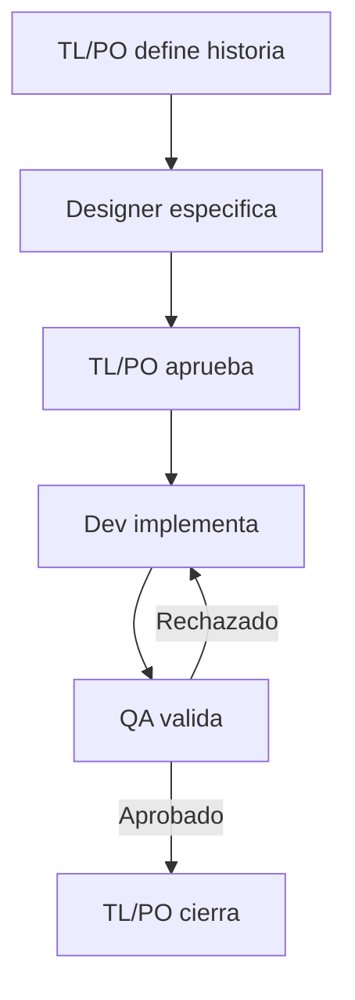

# Equipo de agentes y flujo de trabajo

## Modelo de equipo

| Rol | Responsable | Autoridad principal |
|---|---|---|
| PO | Rodrigo + asistente principal | Problema, prioridad, alcance y criterios de aceptación |
| TL | Rodrigo + asistente principal | Arquitectura, división técnica, riesgos y aprobación del enfoque |
| Diseño | Agente `designer` | Flujo, interacción, UI, accesibilidad y criterios visuales |
| Desarrollo | Agente `dev` | Implementación y pruebas técnicas dentro del alcance aprobado |
| QA | Agente `qa` | Validación independiente, evidencia y recomendación de aprobación |

TL/PO conserva la decisión final. Los agentes especializados recomiendan y ejecutan dentro del alcance asignado; no deciden unilateralmente nuevas funcionalidades, gastos o despliegues.

## Por qué agentes y skills separados

- El **agente** define rol, permisos y comportamiento durante una sesión delegada.
- El **skill** define el procedimiento repetible y el formato de salida para una clase de tarea.

Esto permite usar, por ejemplo, `$mishow-qa-review` desde el agente principal o pedir explícitamente que el agente `qa` lo ejecute.

## Flujo de una historia



Diseño es opcional para tareas puramente técnicas. QA no es opcional para cambios de comportamiento antes de cerrar una historia.

## Contrato de historia lista para trabajar

Una historia está `READY` cuando contiene:

- Problema y usuario afectado.
- Resultado esperado.
- Alcance incluido y excluido.
- Criterios de aceptación observables.
- Diseño o decisión de que no lo requiere.
- Restricciones técnicas o de costo.
- Métrica o forma de validar valor cuando corresponda.

## Handoffs

### TL/PO → Diseño

- Problema, usuario, objetivo y restricciones.
- Preguntas que el diseño debe resolver.
- Qué no debe agregarse al alcance.

### Diseño → Dev

- Flujo aprobado.
- Pantallas, componentes y estados.
- Comportamiento responsive y accesible.
- Criterios visuales comprobables.

### Dev → QA

- Historia y criterios cubiertos.
- Archivos y comportamiento modificados.
- Tests ejecutados.
- Riesgos, supuestos y casos que requieren atención.

### QA → TL/PO

- Veredicto.
- Hallazgos por severidad.
- Evidencia y cobertura.
- Riesgo residual y recomendación.

## Estrategia de concurrencia

- Se puede ejecutar Diseño y exploración técnica en paralelo si ambos solo leen.
- QA puede preparar el plan de pruebas mientras Dev implementa, usando la historia aprobada.
- La ejecución final de QA comienza sobre un cambio estable entregado por Dev.
- Solo un agente debe editar código de producto por historia.
- No ejecutar dos agentes Dev sobre los mismos archivos al mismo tiempo.

## Prompts de uso

### Planificar una historia

```text
Actuaremos como TL/PO. Convierte este objetivo en una historia READY.
Pide al agente designer que proponga el flujo y al agente qa que prepare
los escenarios de aceptación. Ambos deben trabajar en modo lectura.
Espera sus resultados y entrégame una propuesta consolidada; no escribas código.
```

### Implementar

```text
La historia está aprobada. Pide al agente dev que use
$mishow-implement-feature, implemente el alcance y prepare el handoff para QA.
No despliegues nada.
```

### Validar

```text
Pide al agente qa que use $mishow-qa-review sobre el cambio actual contra main.
Debe ejecutar las verificaciones pertinentes, no corregir el código y entregar
un veredicto con evidencia.
```

### Ciclo completo controlado

```text
Ejecuta esta historia usando el equipo miShow:
1. Designer entrega especificación si corresponde.
2. Detente para aprobación TL/PO antes de implementar.
3. Tras la aprobación, Dev implementa una sola vez.
4. QA valida el resultado estable.
No despliegues ni amplíes el alcance.
```

## Instalación y verificación

Los agentes quedan en `.codex/agents/` y las skills en `.agents/skills/`, ambas dentro del repositorio. Codex las detecta al abrir y confiar en el proyecto. Si no aparecen, reinicia la extensión.

Verifica las skills en Codex con `/skills` o escribiendo `$mishow-`. Para invocar agentes, pide explícitamente al agente principal que use `dev`, `qa` o `designer`.

