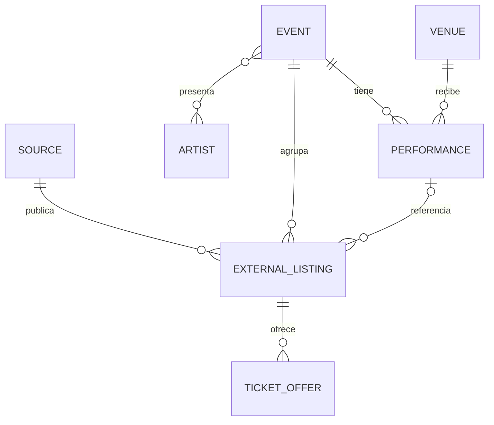

# Borrador del modelo de datos

Este documento define entidades conceptuales. Los nombres, columnas e índices definitivos se validarán al implementar el primer flujo de ingesta.

## Entidades principales

### Event

Representa el evento canónico, independiente de una ticketera.

- `id`
- `name`
- `description`
- `status`
- `image_url`
- `created_at`
- `updated_at`

### Performance

Representa una fecha o función concreta del evento.

- `id`
- `event_id`
- `venue_id`
- `starts_at`
- `timezone`
- `doors_at`
- `status`

### Artist

- `id`
- `name`
- `normalized_name`
- `slug`

La relación entre eventos y artistas es de muchos a muchos.

### Venue

- `id`
- `name`
- `normalized_name`
- `address`
- `commune`
- `region`
- `country_code`
- `latitude`
- `longitude`

### Source

Identifica una ticketera u otra fuente de información.

- `id`
- `name`
- `base_url`
- `enabled`
- `last_success_at`
- `last_failure_at`

### ExternalListing

Relaciona el evento o función canónica con la publicación original.

- `id`
- `source_id`
- `event_id`
- `performance_id`
- `external_id`
- `source_url`
- `source_title`
- `raw_payload`
- `content_hash`
- `first_seen_at`
- `last_seen_at`
- `last_scraped_at`

Debe existir una restricción única basada en la fuente y el identificador externo cuando este sea confiable. En caso contrario se utilizará una clave derivada estable.

### TicketOffer

- `id`
- `external_listing_id`
- `name`
- `currency`
- `min_price`
- `max_price`
- `availability`
- `updated_at`

## Relaciones conceptuales

## Deduplicación

La deduplicación probablemente combinará:

- Nombre normalizado del evento.
- Artistas relacionados.
- Recinto normalizado.
- Fecha, hora y zona horaria.
- Identificador externo de cada fuente.

No debe realizarse una fusión destructiva cuando la coincidencia sea incierta. Es preferible mantener registros separados y registrar candidatos a revisión.

## Pendientes

- Definir estrategia de slugs.
- Definir almacenamiento y retención de payloads originales.
- Precisar estados de evento, función y disponibilidad.
- Decidir si precios históricos forman parte del MVP.
- Definir soporte inicial para eventos con fecha o recinto por confirmar.
- Evaluar búsqueda nativa de PostgreSQL frente a un servicio especializado en fases posteriores.

