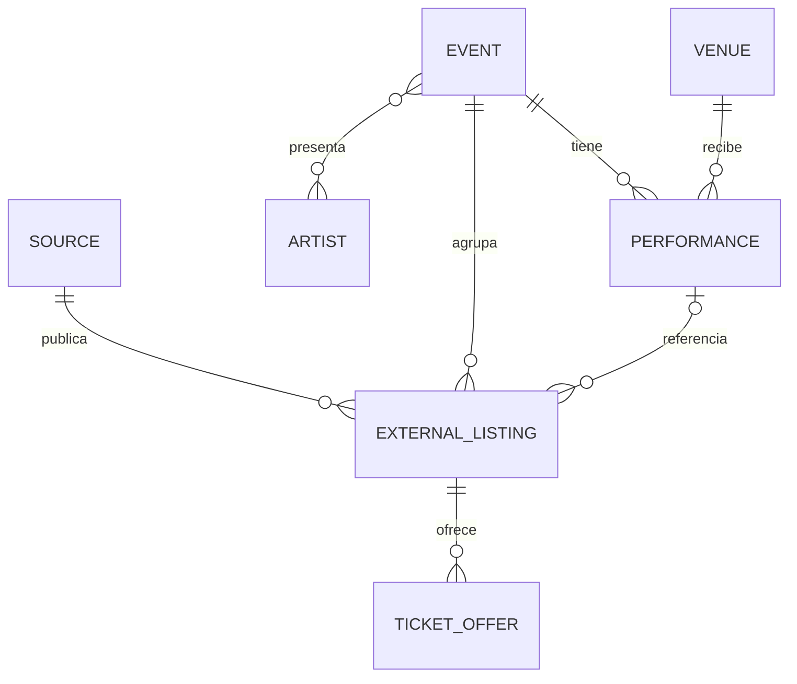

# Modelo de datos

> **Estado (2026-09-13): modelo canónico implementado.** El brief 003
> (`docs/briefs/003-modelo-canonico-eventos.md`) reescribió el esquema de catálogo
> hacia el modelo canónico descrito conceptualmente más abajo. Esta sección
> documenta el esquema **real ya aplicado**; el borrador conceptual que sigue se
> conserva como referencia de la visión.

## Esquema canónico vigente (migración `20260913200727_canonical_events_model`)

Tablas de catálogo (todas con RLS de solo lectura para `anon`/`authenticated`;
escritura solo `service_role`):

- **`sources`** — ticketera/fuente (`code`, `name`, `base_url`). Se conserva.
- **`events`** — evento **canónico**, independiente de la fuente:
  `id, slug (único), match_key (único), name, category (default 'musica'),
  subcategory, description, venue_id, status, image_url, needs_review,
  first_seen_at, last_seen_at`.
- **`event_sources`** — observación de un evento canónico en una fuente:
  `event_id, source_id, source_url, source_code, purchase_url, status,
  price_min/max, currency, image_url, *_seen_at`. Único `(source_id, source_url)`.
- **`artists`** — entidad propia: `id, slug (único), normalized_name (único),
  name, description, city, country, genre, image_url, links, verified`.
- **`venues`** — entidad propia: `id, slug (único), normalized_name (único),
  name, address, city, latitude, longitude, capacity, links, image_url`.
- **`event_artists`** — N:M `(event_id, artist_id, position)`.
- **`performances`** — funciones del evento canónico:
  `event_id, starts_at, timezone, status, performance_code, purchase_url`.
  Único `(event_id, starts_at)`.

**Deduplicación (implementada, conservadora):** al persistir, el evento canónico
se resuelve por `match_key = <venue_normalizado>|<nombre_normalizado>`. Solo se
unen observaciones cuando coinciden **venue y nombre normalizados**; nunca por
nombre solo. Distintos venues ⇒ eventos distintos (validado: "Alberto Plaza -
Esencial Tour" en Dreams Valdivia vs Puerto Varas = 2 canónicos). Los helpers SQL
`unaccent_simple`, `mishow_slugify` y `mishow_unique_slug` derivan slugs estables.

**Contrato de lectura del frontend:** vista **`catalog_events_v2`** (reemplaza a
`catalog_events_v1`, retirada). Expone por evento canónico: `slug, name, category,
status, image_url, next_performance_at, artists[] (name, slug), venue (slug…),
sources[] (source, source_url, purchase_url, status, precios), performances[]`.

**Vistas de entidad (brief 004):** `catalog_artists_v1` y `catalog_venues_v1`
exponen cada artista/venue con sus **próximos eventos** (para las páginas
`/artistas` y `/venues`). Solo lectura (`security_invoker`).

> **Frontend operativo sobre v2 (brief 004):** `@mishow/catalog-client` y la web
> consumen `catalog_events_v2` (+ las vistas de artista/venue). El precio y el
> acceso a compra se resuelven desde `sources[]` (precio combinado + un botón por
> ticketera). Rutas por slug vía query param (`/evento?slug=`, `/artistas?slug=`,
> `/venues?slug=`), manteniendo el export estático (SSG). El cron/persistencia ya
> operaban sobre el modelo canónico desde el brief 003.

**Nota conocida:** Ticketmaster no expone `performer` en su JSON-LD, por lo que sus
eventos no pueblan `artists` todavía (derivar el artista desde el nombre queda como
mejora futura). PuntoTicket sí puebla artistas.

---

## Borrador conceptual (referencia de la visión)

Este documento define entidades conceptuales. El primer esquema ejecutable para
PuntoTicket se define en la migración Supabase y se documenta en
[`persistencia-puntoticket-supabase.md`](persistencia-puntoticket-supabase.md);
este borrador sigue describiendo la evolución canónica entre múltiples fuentes.

## Entidades principales

### Event

Representa el evento canónico, independiente de una ticketera.

- `id`
- `name`
- `description`
- `status`
- `image_url`
- `created_at`
- `updated_at`

Durante el flujo fixture-first, el contrato normalizado conserva además
`extracted_at` (obligatorio), `image_url` HTTPS opcional y coordenadas
opcionales del recinto. `source_code` es opcional: no debe fabricarse a partir
de enlaces de compra.

### Performance

Representa una fecha o función concreta del evento.

- `id`
- `event_id`
- `venue_id`
- `starts_at`
- `timezone`
- `doors_at`
- `status`

### Artist

- `id`
- `name`
- `normalized_name`
- `slug`

La relación entre eventos y artistas es de muchos a muchos.

### Venue

- `id`
- `name`
- `normalized_name`
- `address`
- `commune`
- `region`
- `country_code`
- `latitude`
- `longitude`

### Source

Identifica una ticketera u otra fuente de información.

- `id`
- `name`
- `base_url`
- `enabled`
- `last_success_at`
- `last_failure_at`

### ExternalListing

Relaciona el evento o función canónica con la publicación original.

- `id`
- `source_id`
- `event_id`
- `performance_id`
- `external_id`
- `source_url`
- `source_title`
- `raw_payload`
- `content_hash`
- `first_seen_at`
- `last_seen_at`
- `last_scraped_at`

Debe existir una restricción única basada en la fuente y el identificador externo cuando este sea confiable. En caso contrario se utilizará una clave derivada estable.

### TicketOffer

- `id`
- `external_listing_id`
- `name`
- `currency`
- `min_price`
- `max_price`
- `availability`
- `updated_at`

## Relaciones conceptuales

## Deduplicación

Hasta implementar persistencia, la clave provisional de una publicación es la
pareja `source` + `source_url` canónica. Es una convención de aplicación, no
una restricción SQL; la historia de persistencia deberá definir la migración y
las restricciones PostgreSQL correspondientes.

La deduplicación probablemente combinará:

- Nombre normalizado del evento.
- Artistas relacionados.
- Recinto normalizado.
- Fecha, hora y zona horaria.
- Identificador externo de cada fuente.

No debe realizarse una fusión destructiva cuando la coincidencia sea incierta. Es preferible mantener registros separados y registrar candidatos a revisión.

## Pendientes

- Definir estrategia de slugs.
- Definir almacenamiento y retención de payloads originales.
- Precisar estados de evento, función y disponibilidad.
- Decidir si precios históricos forman parte del MVP.
- Definir soporte inicial para eventos con fecha o recinto por confirmar.
- Evaluar búsqueda nativa de PostgreSQL frente a un servicio especializado en fases posteriores.
